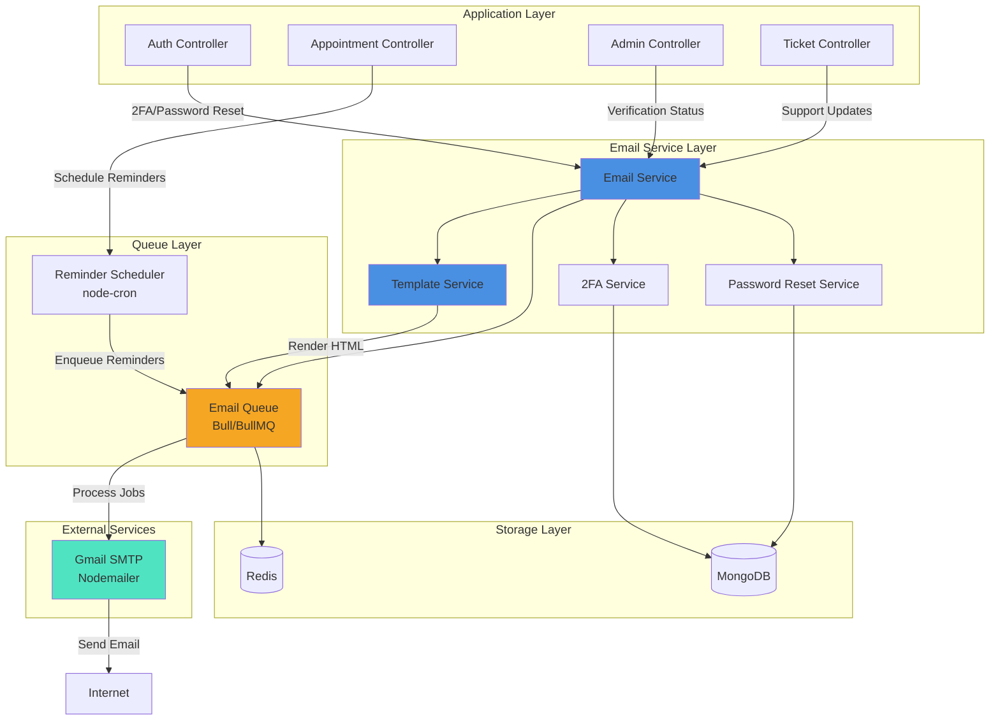
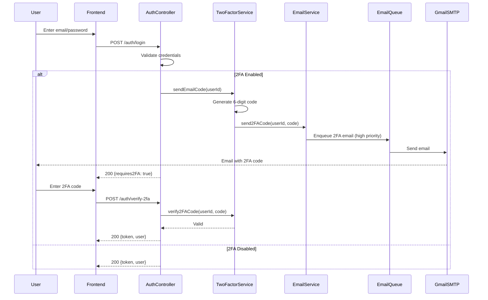
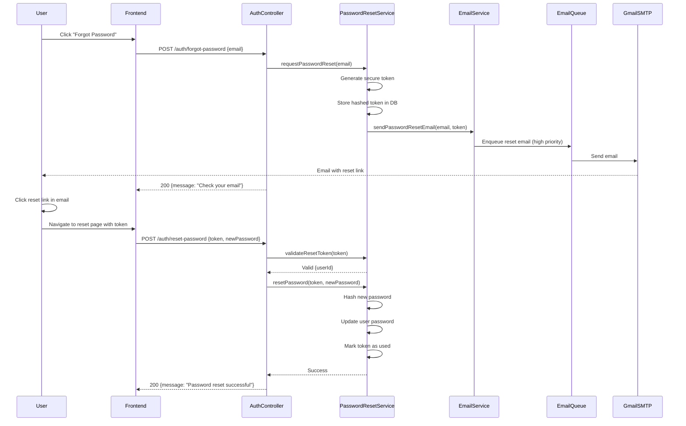
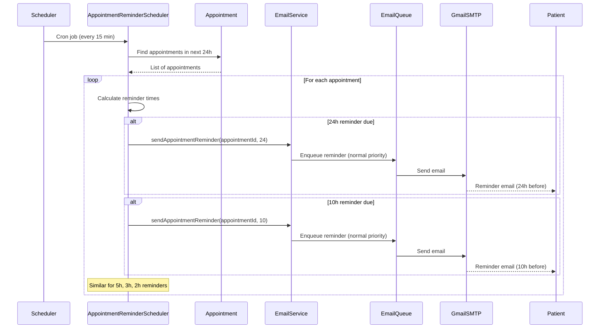
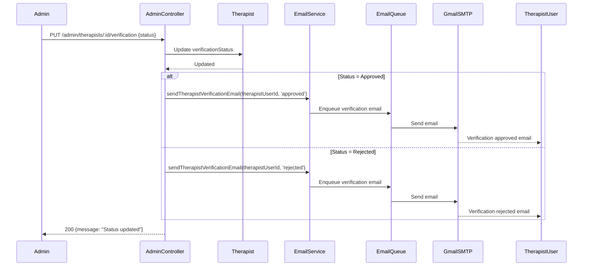
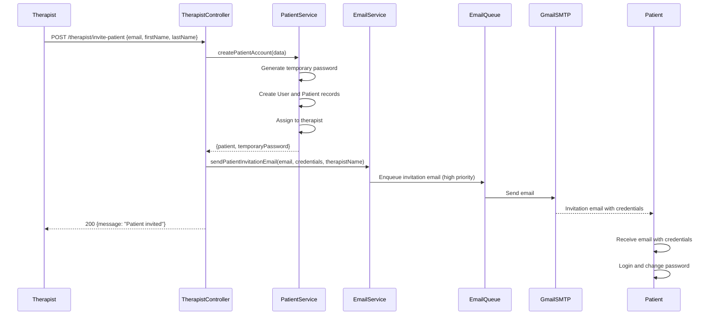

# Design Document: Email System Integration

## Overview

The Email System Integration feature adds comprehensive email capabilities to the Benzi mental health platform. This system enables secure authentication flows (2FA, password reset), automated appointment reminders, therapist verification notifications, patient invitation emails, and support ticket updates. The design leverages Gmail SMTP with branded HTML templates and follows transactional email best practices for reliability and deliverability.

The system is built around a modular architecture with separate services for email dispatch, template rendering, and queue management. All emails are branded with the Benzi logo and theme colors, with the sender name configured as "BENZI" for consistent brand recognition.

## Architecture



### Architecture Flow

1. **Trigger Events**: Controllers detect events requiring email (login with 2FA, password reset request, appointment booking, verification status change, ticket update)
2. **Email Service**: Central service validates recipients, selects templates, and enqueues email jobs
3. **Template Service**: Renders HTML and plain-text versions with dynamic data and Benzi branding
4. **Queue Layer**: Bull/BullMQ manages async job processing with retry logic and failure handling
5. **SMTP Transport**: Nodemailer sends emails via Gmail SMTP with authentication
6. **Scheduler**: node-cron runs periodic jobs to check upcoming appointments and enqueue reminder emails

## Components and Interfaces

### Component 1: Email Service

**Purpose**: Central orchestrator for all email operations. Validates recipients, selects templates, manages email dispatch, and tracks delivery status.

**Interface**:
```javascript
interface EmailService {
  // Core sending
  sendEmail(options: EmailOptions): Promise<EmailResult>
  
  // 2FA emails
  send2FACode(userId: string, code: string): Promise<EmailResult>
  
  // Password reset
  sendPasswordResetEmail(email: string, resetToken: string): Promise<EmailResult>
  
  // Appointment reminders
  sendAppointmentReminder(appointmentId: string, hoursBeforeAppointment: number): Promise<EmailResult>
  
  // Therapist verification
  sendTherapistVerificationEmail(therapistUserId: string, status: VerificationStatus): Promise<EmailResult>
  
  // Patient invitation
  sendPatientInvitationEmail(patientEmail: string, credentials: PatientCredentials, therapistName: string): Promise<EmailResult>
  
  // Support tickets
  sendTicketUpdateEmail(ticketId: string, updateType: TicketUpdateType): Promise<EmailResult>
}

interface EmailOptions {
  to: string
  subject: string
  templateId: string
  templateData: Record<string, any>
  priority?: 'high' | 'normal' | 'low'
  category?: 'transactional' | 'informational' | 'bulk'
}

interface EmailResult {
  success: boolean
  messageId?: string
  error?: string
}

```

**Responsibilities**:
- Validate email addresses before sending
- Select appropriate email template based on event type
- Enqueue email jobs with proper priority
- Track email delivery status
- Handle bounce notifications
- Implement retry logic for failed sends

### Component 2: Template Service

**Purpose**: Manages email templates, renders HTML and plain-text versions with dynamic data, and ensures consistent Benzi branding.

**Interface**:
```javascript
interface TemplateService {
  renderTemplate(templateId: string, data: TemplateData): Promise<RenderedTemplate>
  getTemplateById(templateId: string): EmailTemplate
  validateTemplateData(templateId: string, data: TemplateData): ValidationResult
}

interface EmailTemplate {
  id: string
  name: string
  subject: string
  htmlPath: string
  textPath: string
  requiredVariables: string[]
}

interface RenderedTemplate {
  html: string
  text: string
  subject: string
}

interface TemplateData {
  recipientName: string
  recipientEmail: string
  [key: string]: any
}
```

**Responsibilities**:
- Load HTML and plain-text template files
- Inject dynamic variables (recipient name, action URLs, expiry times)
- Apply Benzi branding (logo, colors, footer)
- Validate required template variables are provided
- Generate plain-text fallback for all HTML emails
- Ensure responsive design for mobile clients


### Component 3: Two-Factor Authentication Service

**Purpose**: Manages TOTP-based 2FA for user login security. Generates secrets, validates codes, and sends 2FA codes via email.

**Interface**:
```javascript
interface TwoFactorService {
  // Setup 2FA
  generateSecret(userId: string): Promise<TwoFactorSecret>
  enable2FA(userId: string, secret: string, verificationCode: string): Promise<boolean>
  disable2FA(userId: string, password: string): Promise<boolean>
  
  // Verification
  verify2FACode(userId: string, code: string): Promise<boolean>
  
  // Email-based 2FA
  sendEmailCode(userId: string): Promise<EmailCodeResult>
  verifyEmailCode(userId: string, code: string): Promise<boolean>
  
  // Backup codes
  generateBackupCodes(userId: string): Promise<string[]>
  useBackupCode(userId: string, code: string): Promise<boolean>
}

interface TwoFactorSecret {
  secret: string
  qrCodeUrl: string
  backupCodes: string[]
}

interface EmailCodeResult {
  success: boolean
  expiresAt: Date
}
```

**Responsibilities**:
- Generate TOTP secrets using speakeasy or similar library
- Store 2FA secrets securely (encrypted in database)
- Validate 6-digit TOTP codes with time window tolerance
- Generate and send time-limited email codes (6 digits, 10-minute expiry)
- Manage backup codes for account recovery
- Track failed verification attempts and implement rate limiting


### Component 4: Password Reset Service

**Purpose**: Manages secure password reset flow with email-based token verification.

**Interface**:
```javascript
interface PasswordResetService {
  requestPasswordReset(email: string): Promise<ResetRequestResult>
  validateResetToken(token: string): Promise<TokenValidation>
  resetPassword(token: string, newPassword: string): Promise<ResetResult>
  invalidateAllTokens(userId: string): Promise<void>
}

interface ResetRequestResult {
  success: boolean
  message: string
}

interface TokenValidation {
  valid: boolean
  userId?: string
  expiresAt?: Date
}

interface ResetResult {
  success: boolean
  error?: string
}
```

**Responsibilities**:
- Generate cryptographically secure reset tokens (32+ bytes)
- Store tokens with expiry (1 hour default)
- Send password reset email with token link
- Validate tokens before allowing password change
- Invalidate token after successful password reset
- Implement rate limiting (max 3 requests per hour per email)
- Use neutral messaging to prevent email enumeration attacks

### Component 5: Email Queue Worker

**Purpose**: Processes email jobs asynchronously with retry logic and failure handling.

**Interface**:
```javascript
interface EmailQueueWorker {
  processEmailJob(job: EmailJob): Promise<JobResult>
  handleJobFailure(job: EmailJob, error: Error): Promise<void>
  retryFailedJob(jobId: string): Promise<void>
}

interface EmailJob {
  id: string
  to: string
  subject: string
  html: string
  text: string
  priority: 'high' | 'normal' | 'low'
  attempts: number
  maxAttempts: number
}

interface JobResult {
  success: boolean
  messageId?: string
  error?: string
}
```

**Responsibilities**:
- Pull jobs from Bull/BullMQ queue
- Send emails via Nodemailer SMTP transport
- Implement exponential backoff retry (1min, 5min, 30min)
- Log all send attempts with timestamps
- Handle SMTP errors gracefully
- Mark jobs as failed after max retries
- Track delivery metrics (sent, failed, bounced)


### Component 6: Appointment Reminder Scheduler

**Purpose**: Runs periodic jobs to check upcoming appointments and enqueue reminder emails at specified intervals.

**Interface**:
```javascript
interface AppointmentReminderScheduler {
  start(): void
  stop(): void
  checkAndScheduleReminders(): Promise<void>
  scheduleReminder(appointmentId: string, sendAt: Date, hoursBeforeAppointment: number): Promise<void>
}
```

**Responsibilities**:
- Run cron job every 15 minutes to check upcoming appointments
- Calculate reminder send times (24h, 10h, 5h, 3h, 2h before appointment)
- Enqueue reminder emails at appropriate times
- Prevent duplicate reminders (track sent reminders in database)
- Skip reminders for cancelled appointments
- Handle timezone conversions correctly

## Data Models

### Model 1: TwoFactorAuth

```javascript
interface TwoFactorAuth {
  userId: ObjectId              // Reference to User
  secret: string                // Encrypted TOTP secret
  enabled: boolean              // Whether 2FA is active
  backupCodes: string[]         // Hashed backup codes
  emailCodeHash?: string        // Hashed email verification code
  emailCodeExpiresAt?: Date     // Email code expiry
  failedAttempts: number        // Failed verification count
  lastFailedAt?: Date           // Last failed attempt timestamp
  createdAt: Date
  updatedAt: Date
}
```

**Validation Rules**:
- `secret` must be encrypted before storage (AES-256)
- `backupCodes` must be hashed (bcrypt) before storage
- `emailCodeHash` expires after 10 minutes
- `failedAttempts` resets to 0 after successful verification
- Rate limit: max 5 failed attempts per 15 minutes

### Model 2: PasswordResetToken

```javascript
interface PasswordResetToken {
  userId: ObjectId              // Reference to User
  token: string                 // Hashed reset token
  expiresAt: Date               // Token expiry (1 hour)
  used: boolean                 // Whether token has been used
  createdAt: Date
}
```

**Validation Rules**:
- `token` must be hashed (SHA-256) before storage
- `expiresAt` defaults to 1 hour from creation
- Token is single-use (marked as `used` after password reset)
- Expired or used tokens cannot be reused
- Max 3 active tokens per user at any time


### Model 3: EmailLog

```javascript
interface EmailLog {
  recipient: string             // Email address (masked in logs)
  templateId: string            // Template identifier
  subject: string               // Email subject line
  category: string              // 'transactional' | 'informational' | 'bulk'
  priority: string              // 'high' | 'normal' | 'low'
  status: string                // 'queued' | 'sent' | 'delivered' | 'bounced' | 'failed'
  messageId?: string            // SMTP message ID
  error?: string                // Error message if failed
  attempts: number              // Number of send attempts
  sentAt?: Date                 // When email was sent
  deliveredAt?: Date            // When email was delivered
  bouncedAt?: Date              // When email bounced
  createdAt: Date
  updatedAt: Date
}
```

**Validation Rules**:
- `recipient` is masked in logs (show only first 3 chars + domain)
- `status` transitions: queued → sent → delivered OR queued → sent → bounced OR queued → failed
- `attempts` increments on each retry (max 3)
- `error` is logged for debugging but not exposed to users
- Logs retained for 90 days for audit purposes

### Model 4: AppointmentReminder

```javascript
interface AppointmentReminder {
  appointmentId: ObjectId       // Reference to Appointment
  hoursBeforeAppointment: number // 24, 10, 5, 3, or 2
  scheduledFor: Date            // When reminder should be sent
  sent: boolean                 // Whether reminder was sent
  sentAt?: Date                 // When reminder was actually sent
  emailLogId?: ObjectId         // Reference to EmailLog
  createdAt: Date
  updatedAt: Date
}
```

**Validation Rules**:
- `hoursBeforeAppointment` must be one of: 24, 10, 5, 3, 2
- `scheduledFor` calculated as appointment.date minus hoursBeforeAppointment
- `sent` defaults to false, set to true after email is queued
- Only one reminder per appointment per time interval
- Reminders not sent for cancelled appointments

## Email Templates

### Template Structure

All email templates follow this structure:

```html
<!DOCTYPE html>
<html>
<head>
  <meta charset="UTF-8">
  <meta name="viewport" content="width=device-width, initial-scale=1.0">
  <title>{{subject}}</title>
  <style>
    /* Responsive styles, Benzi brand colors */
  </style>
</head>
<body>
  <div class="email-container">
    <!-- Header with Benzi logo -->
    <div class="header">
      
    </div>
    
    <!-- Main content -->
    <div class="content">
      <h1>{{greeting}}</h1>
      <p>{{bodyContent}}</p>
      
      <!-- Primary CTA button -->
      <a href="{{actionUrl}}" class="cta-button">{{actionText}}</a>
      
      <!-- Fallback link -->
      <p class="fallback-link">
        Or copy this link: <a href="{{actionUrl}}">{{actionUrl}}</a>
      </p>
    </div>
    
    <!-- Footer -->
    <div class="footer">
      <p>BENZI Mental Health Platform</p>
      <p>{{currentYear}} All rights reserved</p>
      <p><a href="{{preferencesUrl}}">Email Preferences</a></p>
    </div>
  </div>
</body>
</html>
```


### Template List

| Template ID | Purpose | Variables | Priority |
|-------------|---------|-----------|----------|
| `2fa-code` | Send 2FA verification code | `code`, `expiryMinutes` | High |
| `password-reset` | Password reset link | `resetUrl`, `expiryHours` | High |
| `appointment-reminder` | Appointment reminder | `appointmentDate`, `appointmentTime`, `therapistName`, `location`, `hoursUntil` | Normal |
| `therapist-verification-approved` | Verification approved | `therapistName` | Normal |
| `therapist-verification-rejected` | Verification rejected | `therapistName`, `reason` | Normal |
| `patient-invitation` | Patient credentials | `patientEmail`, `temporaryPassword`, `therapistName`, `loginUrl` | High |
| `ticket-created` | Support ticket created | `ticketId`, `subject`, `ticketUrl` | Normal |
| `ticket-reply` | Admin replied to ticket | `ticketId`, `replyMessage`, `ticketUrl` | Normal |
| `ticket-resolved` | Ticket marked resolved | `ticketId`, `subject` | Normal |

### Brand Colors

```css
:root {
  --benzi-primary: #4A90E2;      /* Primary blue */
  --benzi-secondary: #50E3C2;    /* Accent teal */
  --benzi-dark: #2C3E50;         /* Dark text */
  --benzi-light: #F8F9FA;        /* Light background */
  --benzi-success: #27AE60;      /* Success green */
  --benzi-warning: #F39C12;      /* Warning orange */
  --benzi-danger: #E74C3C;       /* Error red */
}
```

## Sequence Diagrams

### 2FA Login Flow




### Password Reset Flow



### Appointment Reminder Flow




### Therapist Verification Email Flow



### Patient Invitation Flow



## Error Handling

### Error Scenario 1: SMTP Connection Failure

**Condition**: Gmail SMTP server is unreachable or authentication fails
**Response**: 
- Email job remains in queue with status "pending"
- Worker logs error with timestamp and SMTP error code
- Job is retried with exponential backoff (1min, 5min, 30min)
**Recovery**: 
- After 3 failed attempts, job is marked as "failed"
- Admin notification sent (if configured)
- Failed jobs can be manually retried from admin panel

### Error Scenario 2: Invalid Email Address

**Condition**: Recipient email address is malformed or invalid
**Response**: 
- Email validation fails before queueing
- Error returned to calling service immediately
- No email job is created
**Recovery**: 
- Calling service handles validation error
- User is prompted to provide valid email address
- No retry attempted for validation errors


### Error Scenario 3: Template Rendering Failure

**Condition**: Template file not found or required variables missing
**Response**: 
- Template service throws validation error
- Error logged with template ID and missing variables
- Email job is not created
**Recovery**: 
- Developer fixes template or provides missing variables
- Calling code updated to include required variables
- No automatic retry for template errors

### Error Scenario 4: Rate Limit Exceeded

**Condition**: Too many emails sent to same recipient in short time
**Response**: 
- Rate limiter blocks email send
- Error returned: "Rate limit exceeded, try again in X minutes"
- Email job is not created
**Recovery**: 
- User waits for rate limit window to expire
- Rate limits: 3 password resets per hour, 5 2FA codes per 15 minutes
- Admin can manually reset rate limits if needed

### Error Scenario 5: Queue Full

**Condition**: Email queue reaches maximum capacity (10,000 jobs)
**Response**: 
- New email jobs are rejected with "Queue full" error
- High-priority emails (2FA, password reset) bypass queue limit
- Normal/low priority emails are delayed
**Recovery**: 
- Queue workers process backlog
- Queue capacity monitored via metrics
- Alert sent to admin if queue > 80% full

### Error Scenario 6: Email Bounce

**Condition**: Email bounces (hard bounce = invalid address, soft bounce = mailbox full)
**Response**: 
- Bounce webhook received from Gmail/SMTP provider
- EmailLog updated with bounce status and reason
- Hard bounce: email marked as invalid, future sends blocked
- Soft bounce: retry up to 3 times over 7 days
**Recovery**: 
- Hard bounce: user must update email address
- Soft bounce: automatic retry with exponential backoff
- Bounce rate monitored to maintain sender reputation

## Testing Strategy

### Unit Testing Approach

**Email Service Tests**:
- Mock Nodemailer transport to avoid sending real emails
- Test email validation logic (valid/invalid addresses)
- Test template selection based on event type
- Test priority assignment (high/normal/low)
- Test error handling for missing templates

**Template Service Tests**:
- Test template rendering with valid data
- Test missing variable detection
- Test HTML and plain-text generation
- Test brand color injection
- Test responsive design rendering

**2FA Service Tests**:
- Test TOTP secret generation
- Test code verification with time window tolerance
- Test backup code generation and validation
- Test email code generation and expiry
- Test rate limiting for failed attempts

**Password Reset Service Tests**:
- Test token generation (cryptographically secure)
- Test token hashing and storage
- Test token validation and expiry
- Test rate limiting (3 requests per hour)
- Test neutral messaging for non-existent emails


**Queue Worker Tests**:
- Test job processing with mock SMTP
- Test retry logic with exponential backoff
- Test max retry limit (3 attempts)
- Test job failure handling
- Test priority queue ordering

**Reminder Scheduler Tests**:
- Test cron job execution
- Test reminder time calculation
- Test duplicate reminder prevention
- Test cancelled appointment handling
- Test timezone conversion

### Integration Testing Approach

**End-to-End Email Flow**:
- Test complete 2FA flow (request code → receive email → verify code)
- Test password reset flow (request → receive email → reset password)
- Test appointment reminder flow (book appointment → receive reminders)
- Test therapist verification flow (admin approves → therapist receives email)
- Test patient invitation flow (therapist invites → patient receives credentials)

**SMTP Integration**:
- Test with real Gmail SMTP in staging environment
- Verify email delivery to test accounts
- Test bounce handling with invalid addresses
- Test rate limiting with Gmail's sending limits
- Verify sender name appears as "BENZI"

**Queue Integration**:
- Test Bull/BullMQ with Redis in staging
- Test job persistence across server restarts
- Test concurrent job processing
- Test queue monitoring and metrics
- Test failed job retry mechanism

**Database Integration**:
- Test 2FA secret storage and retrieval
- Test password reset token CRUD operations
- Test email log creation and querying
- Test appointment reminder tracking
- Test concurrent access and race conditions

## Performance Considerations

**Email Queue Throughput**:
- Target: Process 100 emails per minute
- Use Bull/BullMQ with Redis for high-performance queueing
- Configure multiple worker processes for parallel processing
- Monitor queue depth and processing time

**SMTP Rate Limits**:
- Gmail SMTP: 500 emails per day for free accounts, 2000 for Google Workspace
- Implement rate limiting to stay within provider limits
- Consider upgrading to transactional email service (SendGrid, AWS SES) for higher volume
- Monitor daily send count and alert at 80% capacity

**Database Query Optimization**:
- Index `TwoFactorAuth.userId` for fast lookups
- Index `PasswordResetToken.token` and `PasswordResetToken.expiresAt`
- Index `AppointmentReminder.scheduledFor` and `AppointmentReminder.sent`
- Index `EmailLog.createdAt` for log retention cleanup
- Use compound indexes for common query patterns

**Template Rendering Performance**:
- Cache compiled templates in memory
- Pre-load templates on server startup
- Use streaming for large email batches
- Minimize template complexity (avoid heavy CSS processing)

**Scheduler Efficiency**:
- Run cron job every 15 minutes (balance between timeliness and load)
- Batch reminder queries (find all appointments in next 24h)
- Use database indexes for date range queries
- Limit reminder processing to 1000 appointments per run


## Security Considerations

**Email Content Security**:
- Never include sensitive data in email body (passwords, full tokens, personal health info)
- Use time-limited action links (1 hour for password reset, 10 minutes for 2FA)
- Single-use tokens for password reset
- Mask email addresses in logs (show only first 3 chars + domain)

**Token Security**:
- Generate tokens with crypto.randomBytes (32+ bytes)
- Hash tokens before storage (SHA-256 for password reset, bcrypt for backup codes)
- Encrypt 2FA secrets with AES-256 before storage
- Implement token expiry (1 hour for password reset, 10 minutes for email 2FA)

**Rate Limiting**:
- Password reset: max 3 requests per hour per email
- 2FA email codes: max 5 requests per 15 minutes per user
- Failed 2FA attempts: max 5 per 15 minutes, then temporary lockout
- Appointment reminders: max 5 per appointment (prevent spam)

**Email Enumeration Prevention**:
- Use neutral messaging for password reset ("If an account exists, we sent instructions")
- Don't reveal whether email exists in system
- Same response time for existing and non-existing emails
- Log suspicious patterns (many requests for different emails from same IP)

**SMTP Authentication**:
- Store Gmail app password in environment variable (never commit to repo)
- Use TLS/SSL for SMTP connection (port 465 or 587)
- Rotate app password periodically (every 90 days)
- Monitor for unauthorized access attempts

**SPF, DKIM, DMARC**:
- Configure SPF record for sending domain
- Enable DKIM signing for email authentication
- Set up DMARC policy to prevent spoofing
- Monitor DMARC reports for unauthorized sending

**Data Privacy**:
- Mask recipient email in logs (e.g., "joh***@example.com")
- Retain email logs for 90 days only (GDPR compliance)
- Allow users to export their email history
- Provide unsubscribe mechanism for informational emails
- Don't share email addresses with third parties

**Injection Prevention**:
- Sanitize all user-provided data in templates
- Use parameterized template rendering (prevent HTML injection)
- Validate email addresses with strict regex
- Escape special characters in email content

## Dependencies

**Core Dependencies**:
- `nodemailer` (^6.9.0): SMTP email sending
- `nodemailer-express-handlebars` (^6.1.0): Email template rendering
- `bull` or `bullmq` (^4.0.0): Job queue management
- `ioredis` (^5.3.0): Redis client for Bull queue
- `node-cron` (^3.0.0): Cron job scheduler for reminders
- `speakeasy` (^2.0.0): TOTP 2FA implementation
- `qrcode` (^1.5.0): QR code generation for 2FA setup

**Existing Dependencies** (already in project):
- `mongoose` (^8.0.0): MongoDB ODM
- `bcryptjs` (^2.4.3): Password and backup code hashing
- `jsonwebtoken` (^9.0.0): JWT token generation
- `express` (^4.18.0): Web framework
- `dotenv` (^16.0.0): Environment variable management

**Development Dependencies**:
- `jest` (^29.0.0): Testing framework
- `supertest` (^6.3.0): HTTP testing
- `nodemailer-mock` (^2.0.0): Mock email sending in tests
- `@faker-js/faker` (^8.0.0): Generate test data

**External Services**:
- Gmail SMTP (smtp.gmail.com:587)
- Redis (for Bull queue, can use local or cloud instance)
- MongoDB (existing database)

**Environment Variables** (to be added to .env):
```bash
# Email Configuration
SMTP_HOST=smtp.gmail.com
SMTP_PORT=587
SMTP_SECURE=false
SMTP_USER=therealfaizyabahmad@gmail.com
SMTP_PASSWORD=<app_password>
SMTP_FROM_NAME=BENZI
SMTP_FROM_EMAIL=therealfaizyabahmad@gmail.com

# Redis Configuration (for email queue)
REDIS_HOST=127.0.0.1
REDIS_PORT=6379
REDIS_PASSWORD=

# Email Settings
EMAIL_QUEUE_NAME=benzi-emails
EMAIL_MAX_RETRIES=3
EMAIL_RETRY_DELAY=60000

# 2FA Settings
TOTP_ISSUER=BENZI
TOTP_WINDOW=2
EMAIL_CODE_EXPIRY_MINUTES=10

# Password Reset Settings
PASSWORD_RESET_TOKEN_EXPIRY_HOURS=1
PASSWORD_RESET_RATE_LIMIT_PER_HOUR=3

# Appointment Reminder Settings
REMINDER_INTERVALS=24,10,5,3,2
REMINDER_CRON_SCHEDULE=*/15 * * * *
```

## Correctness Properties

### Property 1: Email Delivery Guarantee

Every high-priority email (2FA, password reset) is either delivered successfully or marked as failed after 3 retry attempts

### Property 2: Token Uniqueness

No two password reset tokens or 2FA secrets can be identical

### Property 3: Token Expiry

Expired tokens (password reset > 1 hour, email 2FA > 10 minutes) cannot be used for authentication

### Property 4: Single-Use Tokens

Password reset tokens can only be used once; subsequent attempts with same token fail

### Property 5: Rate Limit Enforcement

Users cannot exceed rate limits (3 password resets/hour, 5 2FA codes/15min)

### Property 6: Reminder Uniqueness

Each appointment receives exactly one reminder email per time interval (24h, 10h, 5h, 3h, 2h)

### Property 7: Queue Ordering

High-priority emails are processed before normal and low-priority emails

### Property 8: Idempotency

Sending the same email multiple times (due to retries) does not create duplicate sends

### Property 9: Data Encryption

All 2FA secrets are encrypted before storage; all tokens are hashed before storage

### Property 10: Email Validation

Only valid email addresses (RFC 5322 compliant) are accepted for sending
