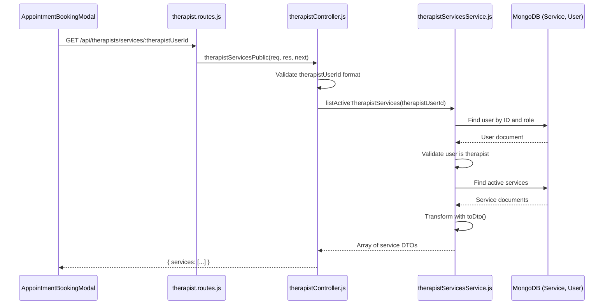

# Technical Design Document

## Overview

This design implements a public API endpoint that allows unauthenticated users (patients) to retrieve a therapist's active services during the appointment booking flow. The endpoint completes the service-based booking system by providing the missing public access point that the frontend booking modal requires.

### Problem Statement

The frontend `AppointmentBookingModal` component already implements full UI and state management for service selection, but currently fails because it attempts to fetch services from a non-existent public endpoint (`GET /api/therapists/services/:therapistUserId`). The existing authenticated endpoint (`GET /api/therapists/services/me`) cannot be used by unauthenticated patients during booking.

### Solution Approach

Add a new public route that:
- Returns only active services for a specified therapist
- Reuses existing service business logic and DTO transformation
- Validates that the therapistUserId corresponds to an actual therapist user
- Maintains backward compatibility with existing authenticated endpoints
- Follows the established pattern of public endpoints (like `/therapists/directory`)

### Key Design Decisions

1. **Controller Placement**: Place the new handler in `therapistController.js` (not `therapistServicesController.js`) because it's a public endpoint about therapists, similar to the existing `therapistDirectory` handler
2. **Route Ordering**: Add the public route BEFORE authenticated routes to prevent middleware conflicts
3. **Service Filtering**: Create a new helper function `listActiveTherapistServices()` that filters only active services, keeping the existing `listTherapistServices()` unchanged for authenticated use
4. **DTO Reuse**: Use the existing `toDto()` transformation to ensure response format consistency
5. **Validation**: Validate both ObjectId format and therapist role to provide clear error messages

## Architecture

### Component Interaction



### Layered Architecture

```
┌─────────────────────────────────────────┐
│  Routes Layer (therapist.routes.js)    │
│  - Public route registration            │
│  - No authentication middleware         │
└─────────────────────────────────────────┘
                  ↓
┌─────────────────────────────────────────┐
│  Controller Layer                       │
│  (therapistController.js)               │
│  - Request validation                   │
│  - Error handling                       │
│  - Response formatting                  │
└─────────────────────────────────────────┘
                  ↓
┌─────────────────────────────────────────┐
│  Service Layer                          │
│  (therapistServicesService.js)          │
│  - Business logic                       │
│  - Data filtering (active only)         │
│  - DTO transformation                   │
└─────────────────────────────────────────┘
                  ↓
┌─────────────────────────────────────────┐
│  Data Layer (Models)                    │
│  - Service model                        │
│  - User model                           │
└─────────────────────────────────────────┘
```

## Components and Interfaces

### 1. Route Definition

**File**: `src/routes/therapist.routes.js`

**New Route**:
```javascript
// Add BEFORE authenticated routes to avoid middleware conflicts
router.get('/services/:therapistUserId', therapistServicesPublic)
```

**Placement Rationale**: Must be placed before the authenticated `/services/me` route to ensure the Express router matches the public route first. If placed after, requests to `/services/:therapistUserId` might incorrectly match `/services/me` with `:therapistUserId` interpreted as "me".

### 2. Controller Function

**File**: `src/controllers/therapistController.js`

**Function Signature**:
```javascript
export async function therapistServicesPublic(req, res, next)
```

**Responsibilities**:
- Extract and validate `therapistUserId` parameter
- Call service layer to retrieve active services
- Handle errors with appropriate HTTP status codes
- Format success response

**Error Handling**:
- 400 Bad Request: Invalid ObjectId format
- 404 Not Found: User doesn't exist or is not a therapist
- 500 Internal Server Error: Unexpected errors passed to Express error handler

**Response Format**:
```javascript
{
  "success": true,
  "message": "OK",
  "data": {
    "services": [
      {
        "id": "string",
        "name": "string",
        "type": "string",
        "description": "string",
        "durationMinutes": number,
        "pricePerSession": number,
        "isActive": true,
        "createdAt": "ISO8601 string"
      }
    ]
  }
}
```

### 3. Service Layer Function

**File**: `src/services/therapistServicesService.js`

**New Function**:
```javascript
export async function listActiveTherapistServices(therapistUserId)
```

**Responsibilities**:
1. Validate that `therapistUserId` corresponds to an actual user with role 'therapist'
2. Query Service collection for active services only (`isActive: true`)
3. Sort by creation date descending (newest first)
4. Transform documents using existing `toDto()` function
5. Return array of service DTOs

**Validation Logic**:
```javascript
// Step 1: Validate user exists and is a therapist
const user = await User.findById(therapistUserId).select('role').lean()
if (!user || user.role !== 'therapist') {
  const err = new Error('Therapist not found')
  err.statusCode = 404
  throw err
}

// Step 2: Query active services
const rows = await Service.find({ 
  therapistUserId, 
  isActive: true 
})
  .sort({ createdAt: -1 })
  .lean()

// Step 3: Transform and return
return rows.map(toDto)
```

**Why Not Modify Existing Function**: The existing `listTherapistServices()` is used by authenticated therapists to view ALL their services (including inactive ones) for management purposes. Creating a separate function maintains separation of concerns and avoids breaking existing functionality.

### 4. Frontend Integration

**File**: `Fyp-To-Reduce-Mental-Health/src/components/AppointmentBookingModal.jsx`

**Current Implementation** (lines 28-47):
```javascript
useEffect(() => {
  if (!open || !doctor?.id) return
  let cancelled = false
  const loadServices = async () => {
    setLoadingServices(true)
    try {
      const json = await api(`/therapists/services/${doctor.id}`, { method: 'GET' })
      if (!cancelled) {
        const serviceList = json.data?.services || []
        setServices(serviceList)
        if (serviceList.length > 0) {
          setSelectedService(serviceList[0]._id)
        }
      }
    } catch (e) {
      if (!cancelled) {
        setServices([])
        setError('Failed to load services.')
      }
    } finally {
      if (!cancelled) setLoadingServices(false)
    }
  }
  void loadServices()
  return () => { cancelled = true }
}, [open, doctor?.id])
```

**No Changes Required**: The frontend already makes the correct API call. Once the backend endpoint is implemented, the integration will work seamlessly.

### 5. Service Validation During Booking

**File**: `src/services/appointmentMutationService.js`

**Current Implementation** (lines 24-38):
```javascript
// Service is now REQUIRED
const rawSid = payload.serviceId
if (!rawSid || String(rawSid).trim() === '' || !mongoose.Types.ObjectId.isValid(String(rawSid))) {
  const err = new Error('Service selection is required')
  err.statusCode = 400
  throw err
}

const service = await Service.findOne({
  _id: rawSid,
  therapistUserId,
  isActive: true,
}).lean()

if (!service) {
  const err = new Error('Service not found for this therapist')
  err.statusCode = 400
  throw err
}
```

**No Changes Required**: The existing validation already:
- Verifies service exists
- Verifies service belongs to the specified therapist
- Verifies service is active
- Stores `serviceName` and `servicePriceAtBooking` in the appointment record

## Data Models

### Service Model

**File**: `src/models/Service.js`

**Schema**:
```javascript
{
  therapistUserId: ObjectId (ref: User, required, indexed)
  name: String (required, trimmed)
  type: String (default: 'Individual Therapy')
  description: String (default: '')
  durationMinutes: Number (default: 60)
  pricePerSession: Number (default: 0)
  isActive: Boolean (default: true)
  createdAt: Date (auto)
  updatedAt: Date (auto)
}
```

**Indexes**:
- `therapistUserId`: Existing index for efficient queries by therapist

**Query Pattern**:
```javascript
Service.find({ 
  therapistUserId: ObjectId, 
  isActive: true 
})
  .sort({ createdAt: -1 })
  .lean()
```

**Performance Considerations**:
- The existing index on `therapistUserId` provides efficient filtering
- Adding a compound index `{ therapistUserId: 1, isActive: 1 }` would optimize the query further, but is not critical given typical service counts (5-20 per therapist)
- The `.lean()` method returns plain JavaScript objects for better performance

### User Model

**File**: `src/models/User.js`

**Relevant Fields**:
```javascript
{
  _id: ObjectId
  role: String (enum: ['patient', 'therapist', 'admin'])
  // ... other fields
}
```

**Query Pattern**:
```javascript
User.findById(therapistUserId)
  .select('role')
  .lean()
```

**Validation Logic**:
- Check user exists: `if (!user)`
- Check role is therapist: `if (user.role !== 'therapist')`

### DTO Transformation

**Function**: `toDto(doc)` in `therapistServicesService.js`

**Transformation**:
```javascript
{
  id: String(doc._id),              // MongoDB ObjectId → string
  name: doc.name,                   // Pass through
  type: doc.type || '',             // Default empty string
  description: doc.description || '', // Default empty string
  durationMinutes: doc.durationMinutes ?? 60, // Nullish coalescing
  pricePerSession: doc.pricePerSession ?? 0,  // Nullish coalescing
  isActive: doc.isActive !== false, // Ensure boolean
  createdAt: doc.createdAt,         // Pass through (ISO string)
}
```

**Consistency**: This transformation is already used by authenticated endpoints, ensuring the public endpoint returns identical data structures.

## Correctness Properties

*A property is a characteristic or behavior that should hold true across all valid executions of a system—essentially, a formal statement about what the system should do. Properties serve as the bridge between human-readable specifications and machine-verifiable correctness guarantees.*


### Property 1: Active Service Filtering and Response Format

*For any* therapist with a mix of active and inactive services, when querying the public services endpoint, the response SHALL contain only services where `isActive` is true, and each service SHALL include all required fields (id, name, type, description, durationMinutes, pricePerSession, isActive, createdAt) with MongoDB `_id` converted to string `id`.

**Validates: Requirements 1.2, 2.1, 2.2, 2.3**

### Property 2: Invalid Therapist ID Handling

*For any* invalid therapist user ID (malformed ObjectId, non-existent user, or user with role other than 'therapist'), when querying the public services endpoint, the system SHALL return HTTP 404 with an appropriate error message.

**Validates: Requirements 1.4**

### Property 3: Service Sorting Order

*For any* therapist with multiple services, when querying the public services endpoint, the returned services SHALL be sorted by creation date in descending order (newest first).

**Validates: Requirements 1.5**

### Property 4: Service Validation During Booking

*For any* appointment booking request with a serviceId, the system SHALL validate that: (1) the service exists, (2) the service belongs to the specified therapist, and (3) the service is active. If any validation fails, the system SHALL return HTTP 400 with a descriptive error message indicating the specific validation failure.

**Validates: Requirements 3.1, 3.2, 3.3, 3.4**

### Property 5: Service Details Persistence

*For any* valid service used in an appointment booking, the system SHALL store the service's name as `serviceName` and the service's price as `servicePriceAtBooking` in the appointment record at the time of booking.

**Validates: Requirements 3.5**

### Property 6: Backward Compatibility

*For any* system operation (dashboard statistics, payment displays, appointment queries), the system SHALL correctly handle both appointments with associated services and appointments without associated services (legacy appointments created before service feature).

**Validates: Requirements 4.5**

## Error Handling

### Error Scenarios and Responses

| Scenario | HTTP Status | Error Message | Handling Location |
|----------|-------------|---------------|-------------------|
| Invalid ObjectId format | 400 | "Invalid therapist ID" | Controller |
| User not found | 404 | "Therapist not found" | Service layer |
| User is not a therapist | 404 | "Therapist not found" | Service layer |
| Service not found during booking | 400 | "Service not found for this therapist" | appointmentMutationService |
| Service belongs to different therapist | 400 | "Service not found for this therapist" | appointmentMutationService |
| Service is inactive | 400 | "Service not found for this therapist" | appointmentMutationService |
| Database connection error | 500 | "Internal server error" | Express error handler |

### Error Response Format

All errors follow the standard response format:

```javascript
{
  "success": false,
  "message": "Error message",
  "data": null
}
```

### Error Handling Strategy

1. **Input Validation**: Validate ObjectId format in controller before calling service layer
2. **Business Logic Errors**: Throw errors with `statusCode` property in service layer
3. **Consistent Messages**: Use the same error message for security-sensitive scenarios (e.g., "Therapist not found" for both non-existent users and non-therapist users to avoid user enumeration)
4. **Error Propagation**: Use Express `next(error)` for unexpected errors to ensure proper logging and monitoring

### Security Considerations

- **User Enumeration Prevention**: Return "Therapist not found" for both non-existent users and users who are not therapists, preventing attackers from discovering valid user IDs
- **Information Disclosure**: Don't expose internal database errors or stack traces in production
- **Rate Limiting**: Public endpoint should be protected by rate limiting middleware (existing infrastructure)

## Testing Strategy

### Testing Approach

This feature requires a **dual testing approach** combining property-based tests for core logic and integration tests for end-to-end workflows:

1. **Property-Based Tests**: Verify universal properties across randomized inputs for core business logic
2. **Unit Tests**: Test specific examples and edge cases
3. **Integration Tests**: Verify end-to-end workflows and external integrations

### Property-Based Testing

**Library**: Use `fast-check` for JavaScript/Node.js property-based testing

**Configuration**: Each property test MUST run minimum 100 iterations

**Test Organization**:
```
benzi-server/
  src/
    services/
      __tests__/
        therapistServicesService.property.test.js
    controllers/
      __tests__/
        therapistController.property.test.js
```

**Property Test Specifications**:

#### Property Test 1: Active Service Filtering
```javascript
// Feature: public-therapist-services-endpoint, Property 1: Active Service Filtering and Response Format
// For any therapist with a mix of active and inactive services, 
// the response contains only active services with all required fields

fc.assert(
  fc.asyncProperty(
    fc.record({
      therapistId: fc.objectId(),
      activeServices: fc.array(fc.serviceDocument({ isActive: true }), { minLength: 0, maxLength: 10 }),
      inactiveServices: fc.array(fc.serviceDocument({ isActive: false }), { minLength: 0, maxLength: 10 })
    }),
    async ({ therapistId, activeServices, inactiveServices }) => {
      // Setup: Create therapist and services in test database
      await setupTherapistWithServices(therapistId, [...activeServices, ...inactiveServices])
      
      // Execute: Call listActiveTherapistServices
      const result = await listActiveTherapistServices(therapistId)
      
      // Verify: Only active services returned
      expect(result).toHaveLength(activeServices.length)
      
      // Verify: All required fields present
      result.forEach(service => {
        expect(service).toHaveProperty('id')
        expect(service).toHaveProperty('name')
        expect(service).toHaveProperty('type')
        expect(service).toHaveProperty('description')
        expect(service).toHaveProperty('durationMinutes')
        expect(service).toHaveProperty('pricePerSession')
        expect(service).toHaveProperty('isActive', true)
        expect(service).toHaveProperty('createdAt')
        expect(typeof service.id).toBe('string')
      })
      
      // Cleanup
      await cleanupTestData(therapistId)
    }
  ),
  { numRuns: 100 }
)
```

#### Property Test 2: Invalid Therapist ID Handling
```javascript
// Feature: public-therapist-services-endpoint, Property 2: Invalid Therapist ID Handling
// For any invalid therapist ID, the system returns 404

fc.assert(
  fc.asyncProperty(
    fc.oneof(
      fc.string().filter(s => !mongoose.Types.ObjectId.isValid(s)), // Malformed
      fc.objectId().filter(async id => !(await User.findById(id))), // Non-existent
      fc.objectId().filter(async id => {
        const user = await User.findById(id)
        return user && user.role !== 'therapist'
      }) // Wrong role
    ),
    async (invalidId) => {
      // Execute and verify error
      await expect(listActiveTherapistServices(invalidId))
        .rejects
        .toMatchObject({
          message: 'Therapist not found',
          statusCode: 404
        })
    }
  ),
  { numRuns: 100 }
)
```

#### Property Test 3: Service Sorting Order
```javascript
// Feature: public-therapist-services-endpoint, Property 3: Service Sorting Order
// For any therapist with multiple services, services are sorted by createdAt descending

fc.assert(
  fc.asyncProperty(
    fc.record({
      therapistId: fc.objectId(),
      services: fc.array(
        fc.serviceDocument({ isActive: true }),
        { minLength: 2, maxLength: 20 }
      )
    }),
    async ({ therapistId, services }) => {
      // Setup: Create services with random creation dates
      await setupTherapistWithServices(therapistId, services)
      
      // Execute
      const result = await listActiveTherapistServices(therapistId)
      
      // Verify: Sorted by createdAt descending
      for (let i = 0; i < result.length - 1; i++) {
        const current = new Date(result[i].createdAt)
        const next = new Date(result[i + 1].createdAt)
        expect(current.getTime()).toBeGreaterThanOrEqual(next.getTime())
      }
      
      // Cleanup
      await cleanupTestData(therapistId)
    }
  ),
  { numRuns: 100 }
)
```

#### Property Test 4: Service Validation During Booking
```javascript
// Feature: public-therapist-services-endpoint, Property 4: Service Validation During Booking
// For any booking request, service validation enforces existence, ownership, and active status

fc.assert(
  fc.asyncProperty(
    fc.record({
      therapistId: fc.objectId(),
      patientId: fc.objectId(),
      validService: fc.serviceDocument({ isActive: true }),
      invalidScenario: fc.oneof(
        fc.constant('non-existent'),
        fc.constant('wrong-therapist'),
        fc.constant('inactive')
      )
    }),
    async ({ therapistId, patientId, validService, invalidScenario }) => {
      // Setup valid service
      await setupTherapistWithServices(therapistId, [validService])
      
      let testServiceId
      let expectedError
      
      switch (invalidScenario) {
        case 'non-existent':
          testServiceId = new mongoose.Types.ObjectId() // Random non-existent ID
          expectedError = 'Service not found for this therapist'
          break
        case 'wrong-therapist':
          const otherTherapistId = new mongoose.Types.ObjectId()
          await setupTherapistWithServices(otherTherapistId, [validService])
          testServiceId = validService._id
          expectedError = 'Service not found for this therapist'
          break
        case 'inactive':
          const inactiveService = { ...validService, isActive: false }
          await setupTherapistWithServices(therapistId, [inactiveService])
          testServiceId = inactiveService._id
          expectedError = 'Service not found for this therapist'
          break
      }
      
      // Execute and verify error
      await expect(
        createAppointmentByPatient(patientId, {
          therapistUserId: therapistId,
          serviceId: testServiceId,
          date: new Date(),
          location: 'online',
          paymentMethod: 'onsite'
        })
      ).rejects.toMatchObject({
        message: expectedError,
        statusCode: 400
      })
      
      // Cleanup
      await cleanupTestData(therapistId)
    }
  ),
  { numRuns: 100 }
)
```

#### Property Test 5: Service Details Persistence
```javascript
// Feature: public-therapist-services-endpoint, Property 5: Service Details Persistence
// For any valid service, appointment stores serviceName and servicePriceAtBooking

fc.assert(
  fc.asyncProperty(
    fc.record({
      therapistId: fc.objectId(),
      patientId: fc.objectId(),
      service: fc.serviceDocument({ isActive: true })
    }),
    async ({ therapistId, patientId, service }) => {
      // Setup
      await setupTherapistWithServices(therapistId, [service])
      
      // Execute: Create appointment
      const appointment = await createAppointmentByPatient(patientId, {
        therapistUserId: therapistId,
        serviceId: service._id,
        date: new Date(),
        location: 'online',
        paymentMethod: 'onsite'
      })
      
      // Verify: Service details stored
      expect(appointment.serviceName).toBe(service.name)
      expect(appointment.servicePriceAtBooking).toBe(service.pricePerSession)
      
      // Cleanup
      await cleanupTestData(therapistId)
    }
  ),
  { numRuns: 100 }
)
```

#### Property Test 6: Backward Compatibility
```javascript
// Feature: public-therapist-services-endpoint, Property 6: Backward Compatibility
// For any system operation, both service-based and legacy appointments are handled correctly

fc.assert(
  fc.asyncProperty(
    fc.record({
      therapistId: fc.objectId(),
      patientId: fc.objectId(),
      appointmentsWithService: fc.array(fc.appointmentDocument({ hasService: true }), { maxLength: 5 }),
      appointmentsWithoutService: fc.array(fc.appointmentDocument({ hasService: false }), { maxLength: 5 })
    }),
    async ({ therapistId, patientId, appointmentsWithService, appointmentsWithoutService }) => {
      // Setup: Create mix of appointments
      await setupAppointments(therapistId, patientId, [
        ...appointmentsWithService,
        ...appointmentsWithoutService
      ])
      
      // Execute: Query appointments (simulating dashboard/payments page)
      const allAppointments = await Appointment.find({ therapistUserId: therapistId })
      
      // Verify: All appointments retrieved successfully
      expect(allAppointments).toHaveLength(
        appointmentsWithService.length + appointmentsWithoutService.length
      )
      
      // Verify: Service-based appointments have service fields
      const withService = allAppointments.filter(a => a.serviceId)
      withService.forEach(appointment => {
        expect(appointment.serviceName).toBeDefined()
        expect(appointment.servicePriceAtBooking).toBeDefined()
      })
      
      // Verify: Legacy appointments work without service fields
      const withoutService = allAppointments.filter(a => !a.serviceId)
      withoutService.forEach(appointment => {
        expect(appointment.serviceName).toBeUndefined()
        expect(appointment.servicePriceAtBooking).toBeUndefined()
      })
      
      // Cleanup
      await cleanupTestData(therapistId)
    }
  ),
  { numRuns: 100 }
)
```

### Unit Tests

**Purpose**: Test specific examples and edge cases not covered by property tests

**Test Cases**:

1. **Empty Services Array**: Therapist with no active services returns empty array with 200 status
2. **Response Wrapper Format**: Verify response has `{ services: [...] }` structure
3. **ObjectId Validation**: Test specific malformed ObjectId formats
4. **Error Message Content**: Verify exact error message wording for user-facing errors

### Integration Tests

**Purpose**: Verify end-to-end workflows and external system integration

**Test Cases**:

1. **Public Endpoint Accessibility**: Verify endpoint is accessible without authentication
2. **Frontend Integration**: Test complete booking flow from modal open to appointment creation
3. **Dashboard Statistics**: Verify dashboard correctly calculates service-based revenue
4. **Payments Page Display**: Verify payments page displays service names and prices

**Test Organization**:
```
benzi-server/
  src/
    __tests__/
      integration/
        publicTherapistServices.integration.test.js
        serviceBookingFlow.integration.test.js
```

### Test Data Generators

**Custom Generators for fast-check**:

```javascript
// Generator for MongoDB ObjectId
fc.objectId = () => fc.hexaString({ minLength: 24, maxLength: 24 })
  .map(hex => new mongoose.Types.ObjectId(hex))

// Generator for Service document
fc.serviceDocument = (overrides = {}) => fc.record({
  _id: fc.objectId(),
  therapistUserId: fc.objectId(),
  name: fc.string({ minLength: 1, maxLength: 100 }),
  type: fc.constantFrom('Individual Therapy', 'Couples Therapy', 'Group Therapy'),
  description: fc.string({ maxLength: 500 }),
  durationMinutes: fc.integer({ min: 15, max: 180 }),
  pricePerSession: fc.integer({ min: 0, max: 50000 }), // In cents
  isActive: fc.boolean(),
  createdAt: fc.date(),
  updatedAt: fc.date()
}).map(doc => ({ ...doc, ...overrides }))

// Generator for Appointment document
fc.appointmentDocument = (overrides = {}) => fc.record({
  _id: fc.objectId(),
  patientUserId: fc.objectId(),
  therapistUserId: fc.objectId(),
  serviceId: overrides.hasService ? fc.objectId() : fc.constant(undefined),
  serviceName: overrides.hasService ? fc.string({ minLength: 1 }) : fc.constant(undefined),
  servicePriceAtBooking: overrides.hasService ? fc.integer({ min: 0 }) : fc.constant(undefined),
  date: fc.date(),
  durationMinutes: fc.integer({ min: 15, max: 180 }),
  location: fc.constantFrom('online', 'office', 'clinic'),
  status: fc.constantFrom('PENDING', 'CONFIRMED', 'COMPLETED', 'CANCELLED'),
  paymentMethod: fc.constantFrom('online', 'onsite'),
  paymentStatus: fc.constantFrom('PENDING', 'VERIFIED', 'REJECTED')
})
```

### Test Coverage Goals

- **Line Coverage**: Minimum 90% for new code
- **Branch Coverage**: Minimum 85% for new code
- **Property Test Iterations**: 100 per property (configurable for CI/CD)
- **Integration Test Coverage**: All user-facing workflows

### Continuous Integration

- Run unit tests and property tests on every commit
- Run integration tests on pull requests
- Generate coverage reports and enforce minimum thresholds
- Run property tests with increased iterations (1000+) on nightly builds

## Implementation Plan

### Phase 1: Service Layer (1-2 hours)

1. Add `listActiveTherapistServices()` function to `therapistServicesService.js`
2. Implement therapist validation logic
3. Implement active service filtering
4. Write unit tests for service layer

### Phase 2: Controller Layer (1 hour)

1. Add `therapistServicesPublic()` function to `therapistController.js`
2. Implement request validation
3. Implement error handling
4. Write unit tests for controller

### Phase 3: Route Registration (30 minutes)

1. Add public route to `therapist.routes.js` BEFORE authenticated routes
2. Verify route ordering with integration test

### Phase 4: Property-Based Tests (2-3 hours)

1. Set up fast-check and test infrastructure
2. Implement custom generators
3. Write all 6 property tests
4. Verify 100 iterations pass for each property

### Phase 5: Integration Testing (1-2 hours)

1. Test public endpoint accessibility
2. Test frontend integration with real booking modal
3. Test backward compatibility with existing appointments
4. Verify dashboard and payments page display

### Phase 6: Documentation and Deployment (1 hour)

1. Update API documentation
2. Add endpoint to Postman collection
3. Deploy to staging environment
4. Perform smoke tests
5. Deploy to production

**Total Estimated Time**: 7-10 hours

## Deployment Considerations

### Database Migrations

**No migrations required**: The Service model and Appointment model already have all necessary fields.

### Backward Compatibility

- Existing authenticated endpoints remain unchanged
- Existing appointments without services continue to work
- Dashboard and payments pages already handle optional service fields

### Rollback Plan

If issues arise:
1. Remove the public route from `therapist.routes.js`
2. Redeploy backend
3. Frontend will gracefully handle API errors (already implemented)

### Monitoring

Add monitoring for:
- Public endpoint response times
- Error rates (especially 404s for invalid therapist IDs)
- Service query performance
- Booking success rates with service selection

### Performance Considerations

- **Query Optimization**: Existing index on `therapistUserId` provides efficient filtering
- **Caching**: Consider adding Redis caching for frequently accessed therapist services (future enhancement)
- **Rate Limiting**: Ensure public endpoint is protected by existing rate limiting middleware

## Security Considerations

### Authentication

- Endpoint is intentionally public (no authentication required)
- Only returns active services (no sensitive data exposure)

### Authorization

- No authorization checks needed (public data)
- Service validation during booking ensures patients can only book valid services

### Data Exposure

- Only exposes active services (inactive services remain private)
- No therapist personal information exposed beyond what's in the service data
- Service prices are public information (necessary for booking decision)

### Input Validation

- Validate ObjectId format to prevent injection attacks
- Sanitize error messages to prevent information disclosure
- Use parameterized queries (Mongoose) to prevent NoSQL injection

### Rate Limiting

- Apply existing rate limiting middleware to prevent abuse
- Consider stricter limits for public endpoints if needed

## Future Enhancements

### Potential Improvements

1. **Service Categories**: Add category/tag system for better service organization
2. **Service Availability**: Link services to specific availability slots
3. **Service Packages**: Support multi-session packages with discounts
4. **Service Reviews**: Allow patients to review specific services
5. **Caching**: Add Redis caching for frequently accessed services
6. **Search/Filter**: Add query parameters for filtering services by type, price range, duration
7. **Pagination**: Add pagination for therapists with many services (currently not needed)

### API Versioning

If breaking changes are needed in the future:
- Use API versioning (e.g., `/api/v2/therapists/services/:therapistUserId`)
- Maintain v1 endpoint for backward compatibility
- Provide migration guide for frontend developers

## Conclusion

This design implements a straightforward public API endpoint that completes the service-based booking system. The implementation:

- **Reuses existing code**: Leverages existing service layer logic and DTO transformation
- **Maintains consistency**: Returns data in the same format as authenticated endpoints
- **Ensures security**: Validates inputs and prevents information disclosure
- **Supports testing**: Designed for comprehensive property-based testing
- **Enables integration**: Allows frontend booking modal to work without modification

The design follows established patterns in the codebase and requires minimal changes to achieve the desired functionality.
