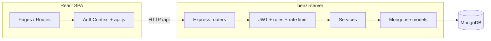

# Benzi platform — module map, status, and next steps

This document explains how the **Fyp-To-Reduce-Mental-Health** (Vite + React) frontend and **benzi-server** (Express + MongoDB) backend fit together, what was delivered recently, what is still open, and a sensible roadmap.

---

## 1. High-level architecture

- The browser talks only to **`/api/*`** (Vite dev server proxies to `benzi-server` on port 5000 by default).
- **JWT** is stored in `sessionStorage` or `localStorage`; `api()` attaches `Authorization: Bearer …` when present.
- **RoleRoute** (frontend) hides therapist/patient/admin areas by `user.role`.
- **Backend** enforces the same boundaries with **`verifyJWT`** + **`requireRoles('patient' | 'therapist' | 'admin')`** and **`expectedPortal`** on login so a therapist cannot authenticate through the patient portal UI contract.

---

## 2. Backend modules (benzi-server)

| Area | Files / routes | Responsibility |
|------|----------------|------------------|
| **Config** | `config/environment.js`, `config/database.js` | Env validation, Mongo URI normalization |
| **Auth** | `routes/auth.routes.js`, `controllers/authController.js`, `services/authService.js` | Register, login (`expectedPortal`), JWT, `/me` |
| **Profiles** | `services/profileService.js` | Upserts `Patient` / `Therapist` extension docs after register/login |
| **Patient** | `routes/patient.routes.js`, `patientController.js`, `patientDashboardService.js` | `GET /api/patients/dashboard/me` |
| **Therapist** | `routes/therapist.routes.js`, `therapistController.js` | `GET /dashboard/me`, **`GET /directory`** (public), **`GET/PATCH /profile/me`** |
| **Therapist data** | `therapistDirectoryService.js`, `therapistProfileService.js`, `therapistDashboardService.js` | Directory listing, editable profile, dashboard KPIs |
| **Appointments** | `routes/appointment.routes.js`, `appointmentService.js` | Patient/therapist appointment lists |
| **Models** | `models/User.js`, `Patient.js`, `Therapist.js`, `Service.js`, `Appointment.js` | Persistence + indexes |
| **Security** | `middleware/verifyJWT.js`, `rateLimiters.js`, `helmet`, `cors` | Authz, limits, headers |

### Therapist model (directory + profile)

Extended fields on **`Therapist`** include: `city`, `profileImageUrl`, `specializationTitle`, `qualification`, `practiceLocation`, `experienceYears`, `bio`, `waitTimeLabel` (plus existing stats: `sessionCount`, `clientCount`, `avgRating`, etc.).

**`Service`** documents supply **fee chips** on the public doctors directory (`name` + `pricePerSession`; display uses `pricePerSession / 100` as **PKR whole units** to stay consistent with existing dashboard revenue math).

---

## 3. Frontend modules (Fyp-To-Reduce-Mental-Health)

| Area | Key files | Responsibility |
|------|-----------|------------------|
| **API** | `src/lib/api.js` | Base URL, token, JSON errors |
| **Auth** | `src/context/AuthContext.jsx`, `LoginPage.jsx`, `RegisterPage.jsx` | Portal-aware login, role on register |
| **Public doctors** | `src/pages/DoctorsPage.jsx` | **`GET /api/therapists/directory`** with `city`, debounced search, pagination |
| **About** | `src/components/MeetDoctors.jsx` | Featured therapists (Lahore, limit 4); fallback cards if API empty/offline |
| **Therapist profile** | `src/pages/therapist/TherapistProfilePage.jsx` | **`GET/PATCH /api/therapists/profile/me`** |
| **Dashboards** | `PatientDashboard.jsx`, `TherapistDashboard.jsx` | Dynamic stats from `/patients/dashboard/me`, `/therapists/dashboard/me` |
| **Appointments** | `PatientAppointmentsPage.jsx`, `TherapistAppointmentsPage.jsx` | Lists from `/api/appointments/.../me` |

---

## 4. What is done (recent scope)

- **Public therapist directory** backed by MongoDB, filterable by **city** and **search query**, with **services → fee badges**.
- **Therapist profile page** loads and saves **User + Therapist** fields (photo via URL, not multipart upload yet).
- **Seed script** `npm run seed:therapists` creates **VERIFIED** therapist users, rich **Therapist** rows (Lahore + one Karachi), **Services**, and writes **`THERAPIST_SEED_CREDENTIALS.md`** (gitignored) with the **shared demo password**.
- **Smoke test** extended with **`GET /api/therapists/directory`**.

---

## 5. What is remaining / gaps

| Item | Notes |
|------|--------|
| **Real file upload** for profile photos | Currently **URL only**; needs storage (S3/local) + upload route |
| **Password change API** | UI placeholder; needs authenticated endpoint + validation |
| **Admin doctors page** | Still static; could list real `User`+`Therapist` like directory |
| **Booking flow** | “Book appointment” still links to generic patient appointments; no **per-therapist** booking |
| **MeetDoctors fallback** | Uses static cards only when API returns zero rows (e.g. before seed) |
| **Islamabad** | Seed is Lahore-heavy; add Islamabad rows if you need that filter to show data |
| **Tests** | No automated frontend tests; API smoke is minimal |
| **Production hardening** | Rotate seed passwords; never ship `THERAPIST_SEED_CREDENTIALS.md`; use proper secrets |

---

## 6. Suggested plan (next iterations)

1. **Short term:** Run **`npm run seed:therapists`** on your machine; confirm **`/doctors`** and **Meet Doctors** show data; log in as a seeded therapist and edit profile; confirm directory updates after refresh.
2. **Booking:** Add `therapistUserId` (or service id) to booking navigation and backend **create appointment** API + UI.
3. **Media:** Add `POST /api/therapists/profile/photo` (multipart) and swap URL field for upload + preview.
4. **Admin:** Replace static **AdminDoctorsPage** with paginated query over therapists.
5. **Observability:** Structured logging, request ids, and optional OpenAPI spec generated from routes.

---

## 7. Commands reference

| Command | Where | Purpose |
|---------|-------|---------|
| `npm run dev` | `benzi-server` | API with watch |
| `npm run dev` | `Fyp-To-Reduce-Mental-Health` | Vite + proxy to API |
| `npm run seed:therapists` | `benzi-server` | Seed therapists + write credentials markdown |
| `npm run test:api` | `benzi-server` | In-memory API smoke |

---

## 8. Dependency graph (npm packages)

**Server:** `express`, `mongoose`, `jsonwebtoken`, `bcryptjs`, `joi`, `helmet`, `cors`, `express-rate-limit`, `morgan`, `dotenv` — standard layered API. **Dev:** `mongodb-memory-server` for smoke tests only.

**Client:** `react`, `react-router-dom`, `recharts`, `lucide-react`, `tailwindcss` (+ Vite toolchain). No direct Mongoose; all persistence goes through **`api()`**.

---

*Last updated alongside therapist directory + profile + seed work.*
